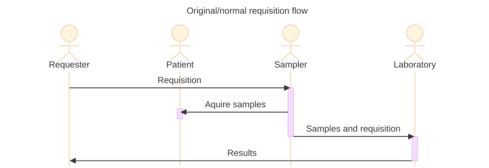
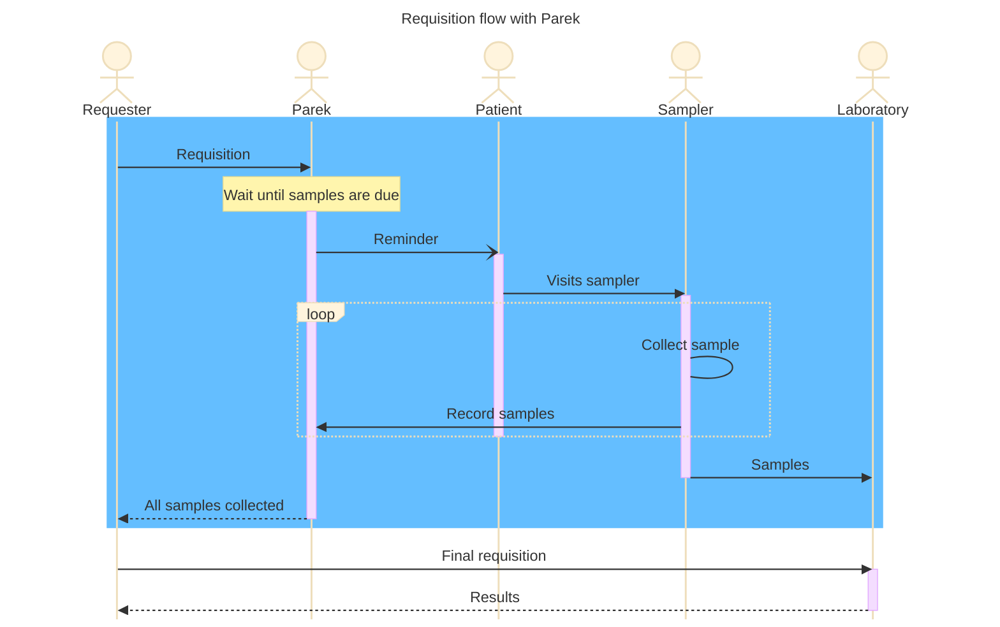
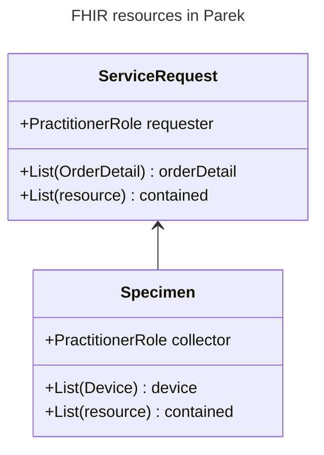

### Introduksjon

Interaksjon mellom lege og pasient skjer typisk i en kontekst med kort utstrekning i tid og rom. Innenfor denne konteksten kan det tas prøver eller bilder og analyseresultater blir tilgjengelige for legen. Konteksten kan være en innleggelse, en avtale eller avtale med oppfølgingsavtale innenfor få dager. Kommunikasjon er typisk elektronisk, men kan også bestå i at pasient får med seg et ark med informasjon om hvilke prøver som skal tas.

Det er to forhold som utfordrer denne lukkede konteksten
- Behov for å frikoble prøvetaking og analysearbeid fra rekvirent
  - Pasienten kan møte opp hvor som helst og få tatt prøvene og de kan sendes til et hvilket som helt laboratorim for analyser.
  - "Frikobling i rom".
- Behov for å frikoble prøvetaking og analysearbeid fra nåværende kontekst
  - Pasienten skal møte opp på et senere tidspunkt og få tatt prøvene, typisk i forkant av en oppfølgingsavtale et stykke (flere måneder) fram i tid.
  - "Frikobling i tid".

Prosjekt "**Pasientens rekvisisjoner**" (**Parek**) er etablert for å løse disse utfordringene.

Første fase av prosjektet handler primært om andre kulepunkt. Selv om det i prinsippet ikke er noe som hindrer at også første kulepunkt dekkes så vil det være begrensninger (f.eks. bruk av lokale kodeverk) i selve datainnholdet som i praksis utelukker at prøver kan tas eller analyseres andre steder enn de forhåndsvalgte. Dette er en flyt som allerede brukes en god del, men den er "manuell" har svakheter som gjerne bunner i at pasient møter opp som avtalt til oppfølging, men har glemt å ta de prøvene som skulle tas. Prosjektet tar sikte på å forvalte orkestreringen av aktørene for at denne flyten skal fungere mer optimalt.

I denne figuren er den del av orkestreringen som Parek tar hånd om markert med blå bakgrunn. Nederst er resten av den manuelle flyten som forvaltes av rekvirenten selv, nå i forvisning om at ting er på plass og har skjedd som de skal.

### Implementasjonsguiden

Denne implementasjonsguiden definerer de ressursene som inngår i den flyten av data som forvaltes av Parek.

Siden Parek ikke er, eller har tilgang til, førstehåndsinformasjon om helsepersonell vil alle PractitionerRole-instanser være contained i den aktuelle ressurs. Det samme gjelder Device som kun eksisterer i kontekst av prøven de inneholder.

ServiceRequest har ingen kunnskap om Specimen. Specimen opprettes med refereranse til ServiceRequest. Parek bruker denne informasjonen til å finne ut om alle forventede prøver er tatt og endrer status fra "active" til "completed".
